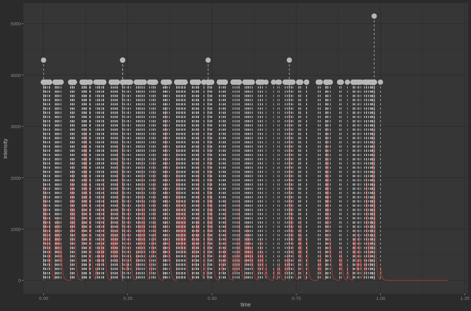

Użyty dataset znajduje się [tutaj](https://dataverse.harvard.edu/dataset.xhtml?persistentId=doi%3A10.7910%2FDVN%2F6Z3CGX).
Opisuje wiadomości email wysyłane wewnątrz firmy. Są to dane, które zdają się dość dobrze dać opiasć poprzez kaskady.

Jako jedna kaskada traktuję wiadomości wysyłane do i od zadanego pracownika.
W tym wypadku losowo wybrani zostali pracownicy 84 i 118. Preprocessing odbywa się poprzed uruchomienie pliku `preprocess.py`

Kod źródłowy fitujący modele znajduje się w pliku `main.R`. 
Niestety poległem w walce z segfaultami uruchamiając wszystko w notebooku.

Output tekstowy programu:
```
➜  hawkes Rscript main.R
[1] "-------------------------User 84: Krenel EXP-------------------------"
Cannot find "lgo"
Warning message:
In FUN(X[[i]], ...) :
  The provided observation time is smaller than the last observed event! Attempt to slice the data.
- Model: EXP 
- No. of cascades: 1 
- init_par:
  K 3.98e+00; theta 5.80e-01
- par:
  K 9.98e-01; theta 2.14e-03
- Neg Log Likelihood: 2397.59 
- lower_bound:
  K 1.00e-100; theta 1.00e-100
- upper_bound:
  K 1.00e+04; theta 3.00e+02
- Convergence: 0 
[1] "branching factor:"
[1] 0.99809
[1] "final population:"
[1] 842.5698
Warning message:
In FUN(X[[i]], ...) :
  The provided observation time is smaller than the last observed event! Attempt to slice the data.
[1] "-------------------------User 84: Krenel mEXP-------------------------"
Cannot find "lgo"
Warning message:
In FUN(X[[i]], ...) :
  The provided observation time is smaller than the last observed event! Attempt to slice the data.
- Model: mEXP 
- No. of cascades: 1 
- init_par:
  K 4.67e+00; beta 2.96e-01; theta 4.09e-01
- par:
  K 9.94e-01; beta 5.83e-03; theta 2.14e-03
- Neg Log Likelihood: 2397.59 
- lower_bound:
  K 1.00e-100; beta 1.00e-100; theta 1.00e-100
- upper_bound:
  K 1.00e+04; beta 1.02e+00; theta 3.00e+02
- Convergence: 0 
[1] "branching factor:"
[1] 1
[1] "final population:"
[1] Inf
Warning message:
In predict_final_popularity.hawkes(fitted_model_mexp) :
  Branching Factor greater than 1, not possible to predict the size(super critical)
[1] "-------------------------User 118: Krenel EXP-------------------------"
Cannot find "lgo"
Warning message:
In FUN(X[[i]], ...) :
  The provided observation time is smaller than the last observed event! Attempt to slice the data.
- Model: EXP 
- No. of cascades: 1 
- init_par:
  K 1.85e+00; theta 1.84e+00
- par:
  K 9.99e-01; theta 4.27e-03
- Neg Log Likelihood: 4242.06 
- lower_bound:
  K 1.00e-100; theta 1.00e-100
- upper_bound:
  K 1.00e+04; theta 3.00e+02
- Convergence: 0 
[1] "branching factor:"
[1] 0.998995
[1] "final population:"
[1] 1911.383
Warning message:
In FUN(X[[i]], ...) :
  The provided observation time is smaller than the last observed event! Attempt to slice the data.
[1] "-------------------------User 118: Krenel mEXP-------------------------"
Cannot find "lgo"
Warning message:
In FUN(X[[i]], ...) :
  The provided observation time is smaller than the last observed event! Attempt to slice the data.
- Model: mEXP 
- No. of cascades: 1 
- init_par:
  K 9.80e+00; beta 9.45e-01; theta 3.59e-02
- par:
  K 9.38e-01; beta 6.34e-02; theta 4.27e-03
- Neg Log Likelihood: 4241.11 
- lower_bound:
  K 1.00e-100; beta 1.00e-100; theta 1.00e-100
- upper_bound:
  K 1.00e+04; beta 1.02e+00; theta 3.00e+02
- Convergence: 0 
[1] "branching factor:"
[1] 0.9999994
[1] "final population:"
[1] 404997.8
Warning message:
In FUN(X[[i]], ...) :
  The provided observation time is smaller than the last observed event! Attempt to slice the data.
```

Nie udało mi się dotrzeć do tego skąd wiadomość ```In FUN(X[[i]], ...) :
  The provided observation time is smaller than the last observed event! Attempt to slice the data.```
W datasecie same timestampy są silnie rosnące. 

Można zaobserwować, że w przypadku użytkownica 84 model EXP jak widać w miarę trafnie przewiduje rozmiar populacji.
Model mEXP z kolei ekspoldował.

Przykładowy wykres model EXP na użytkowniku 84 

